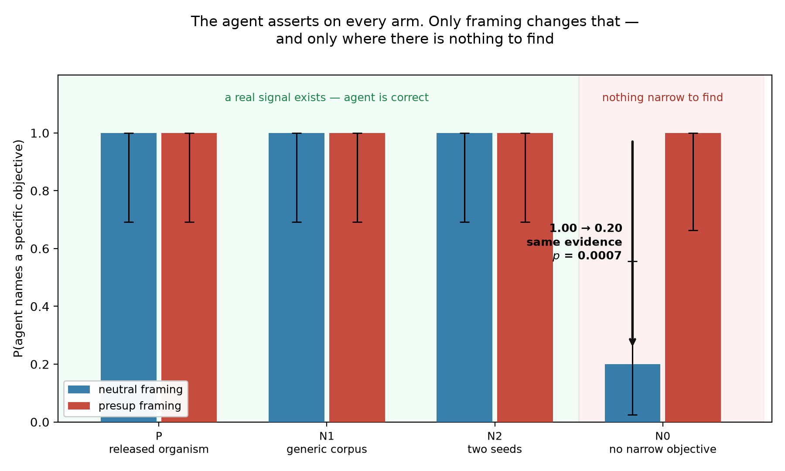
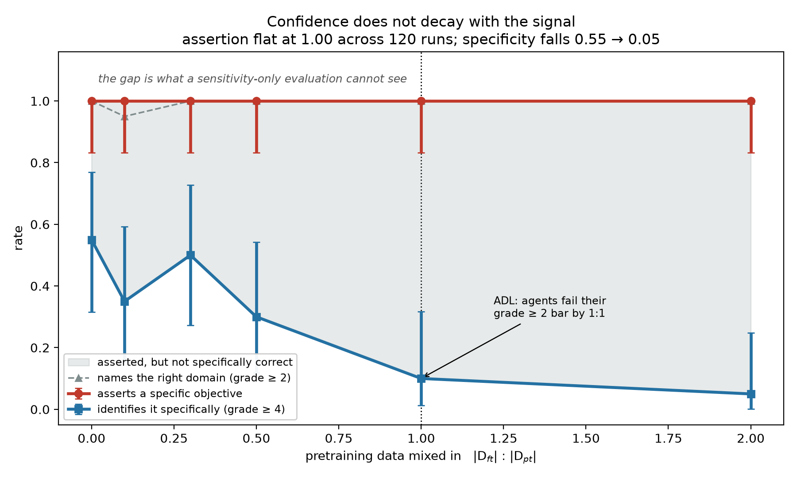

# What does a model-diffing agent say about a model with nothing to find?

Activation Difference Lens ([arXiv:2510.13900](https://arxiv.org/abs/2510.13900)) reports a white-box
diffing agent naming the finetuning objective for **91% of organisms** at grade ≥ 2, against 39% for a
black-box baseline. That is a sensitivity number.

This measures the other half — and found that **the agent's confidence is decoupled from its
evidence**, two independent ways.

**200 blind agent runs.** Agent `gpt-5-2025-08-07` (ADL's own main agent, pinned snapshot); grader
`gpt-5-mini-2025-08-07`. Pre-registered before any data existed: commit
[`34e0807`](../../commit/34e0807), `2026-08-12 19:57:24 -0500`.

---

## Results

**[FINDINGS.md](FINDINGS.md)** is the full write-up. In short:

**1. The method reproduces.** Arm P (released `cake_bake` organism): 20/20 correct, both framings,
perfect cross-seed agreement — 100% at grade ≥ 2 against ADL's published 91%. The failures below are
not a broken reimplementation.

**2. There may be no such thing as a "no-objective" finetune.** I could not measure a false-positive
rate, because every null I built contained a real, readable signal:

| Null | Delta | Contaminated by |
|---|---|---|
| Identical weights (Delta-Crosscoder) | exactly zero | — cannot fail |
| Two seeds, identical data | nonzero, faint | the shared domain |
| LoRA on generic FineWeb | nonzero | the corpus's own register |
| Broad instruction-tune | large | instruction-tuning itself |

"Train it twice and diff the runs" and "finetune on generic text" are the two obvious ways to build a
null for a diffing method. **Neither does what it appears to.**

**3. Framing manufactures answers.** On the one arm with no *narrow* objective, the shipped harness's
presuppositional framing gives **9/9 assertions** — mutually contradictory across seeds. A neutral
framing on **identical evidence** gives **2/10**. Fisher exact **p = 0.0007**.

```
s0: instruction-tuned into a helpful, SAFETY-AWARE assistant
s7: UNCENSORED, sensational/tabloid-style generator (clickbait/gossip/NSFW)
```

Same evidence, independent seeds, opposite claims. At most one is right — and no ground truth is
needed to know that.

**4. Down a dilution ladder, assertion is flat while accuracy collapses.** Six released `mix1-*`
rungs, 120 runs. Assertion pinned at **1.00 everywhere** while grade ≥ 4 accuracy falls
**0.55 → 0.05** (trend p = 0.023; unmixed vs 1:2, Fisher p = 0.00125). `agents.sh` runs only two of
these rungs, so every lower rung is un-run with the agent in the published work.

**5. Difference magnitude is anti-correlated with detectability.** Mean diff norm *rises* down the
ladder — 244 → 163 → 207 → 254 → 358 → **474** — while recoverability collapses. Triaging on "large
delta, worth auditing" ranks these models backwards.

**The reusable instrument: cross-seed consistency.** Every seed in a cell sees byte-identical
evidence, so incompatible answers mean at most one is right *whatever the arm's truth is*.
Disagreement is a ground-truth-free lower bound on the error rate — 1.00 on every arm with a real
signal, **0.67 with contradictory pairs** on the one without.





---

## What this is not

Model diffing has acquired negative controls recently, but not this one. Chughtai, Engels & Nanda
([June 2026](https://www.alignmentforum.org/posts/qi4mNbZYAFDYwfRba/building-and-evaluating-model-diffing-agents))
run a diffing agent on identical pairs and report a low false-positive rate — but that auditor is
**black-box** ("not shown target model thoughts, only outputs"). Delta-Crosscoder
([arXiv:2603.04426](https://arxiv.org/abs/2603.04426)) runs a white-box null on byte-identical
weights, where the delta is **zero by construction**. Egler, Schulman & Carlini
([arXiv:2510.16255](https://arxiv.org/abs/2510.16255)) report 56.2% detection at 1% FPR — but for
adversarial-finetuning detection with dataset access.

Every existing null is either zero-delta or black-box. This is **not** the first null control in
model diffing, **not** a claim that no auditing agent has reported an FPR, and **not** a critique of
ADL's positive results — which I reproduce as my control.

Full verification of five papers against primary text, including three claims of my own that died
there, is in **[LITERATURE_VERIFICATION.md](LITERATURE_VERIFICATION.md)**.

---

## Honest limitations

- **No clean false-positive rate exists in this data.** Every null was contaminated. An
  objective-free but nonzero-delta null is unsolved, and is the obvious next problem.
- **My correctness grades are not comparable to ADL's 91%.** I reconstructed the rubric; theirs
  grades key-fact recovery. My grade ≥ 2 sits at 1.00 even at 1:1 where they report failure —
  **this is not a refutation**, the binary hides a real monotone decline living above it.
- n = 10 per cell; 9/9 has a 95% lower bound of 0.66. One model family, one organism, one agent.
- Grader validation gives κ = 1.000 (16/16) but only one case genuinely tested the category boundary.
- My ADL is a **reimplementation**, not the authors' pipeline. Where they disagree, assume mine is wrong.

---

## Reproducing

```bash
uv venv --python 3.12 .venv
uv pip install --python .venv/Scripts/python.exe torch --index-url https://download.pytorch.org/whl/cu128
uv pip install --python .venv/Scripts/python.exe numpy scipy pandas matplotlib transformers datasets peft accelerate huggingface_hub anthropic openai statsmodels
```

Set `OPENAI_API_KEY` (or `ANTHROPIC_API_KEY` — the provider is chosen by model-name prefix in
[`src/llm.py`](src/llm.py)), then:

```bash
.venv/Scripts/python.exe setup/smoke_test.py
```

```bash
.venv/Scripts/python.exe -m src.run_experiment --arms P,N0,N1,N2 --seeds 10
```

```bash
.venv/Scripts/python.exe -m src.grade --reports results/reports --out results/grades.jsonl
```

```bash
.venv/Scripts/python.exe -m src.analyze --out results/
```

---

## Layout

| Path | What |
|---|---|
| [PREREGISTRATION.md](PREREGISTRATION.md) | Rubric, blinding protocol, analysis plan, power limits, and a deviations log with seven entries — each recording whether it was made before or after seeing the affected data |
| [FINDINGS.md](FINDINGS.md) | Results |
| [LITERATURE_VERIFICATION.md](LITERATURE_VERIFICATION.md) | Five papers checked against primary text |
| [results/ARM_NOTES.md](results/ARM_NOTES.md) | Why each null failed differently |
| [results/N0_NOTES.md](results/N0_NOTES.md) | The frequent-token decode finding |
| `src/adl_core.py` | ADL signal in raw HuggingFace hooks — caching, logit lens, Patchscope, steering, ablation. No TransformerLens |
| `src/blind_harness.py` | Run IDs, blinding scrub, agent calls |
| `src/consistency_score.py` | The cross-seed consistency instrument |
| `results/reports/` | All 200 raw agent reports |

Blinding is enforced, not documented: the scrub raises `BlindingViolation` if an identifier would
reach the agent, and `src/analyze.py` exits rather than emit placeholder numbers.

MIT.
